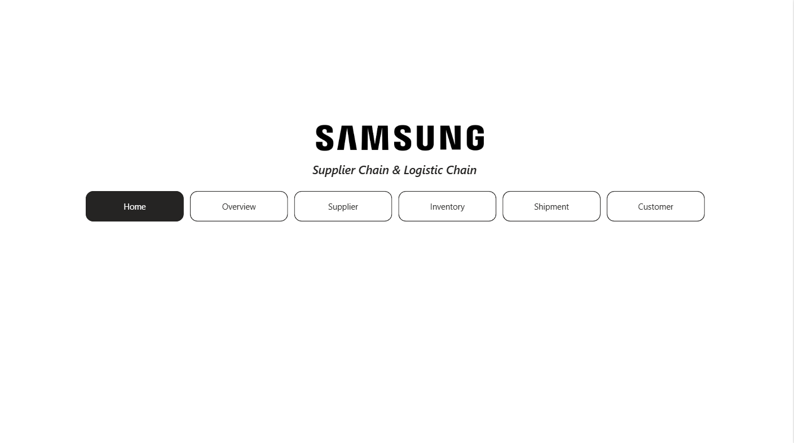
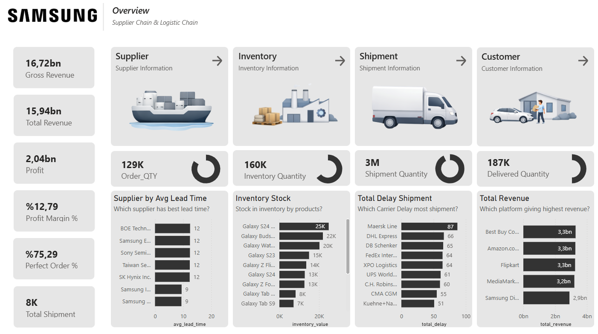
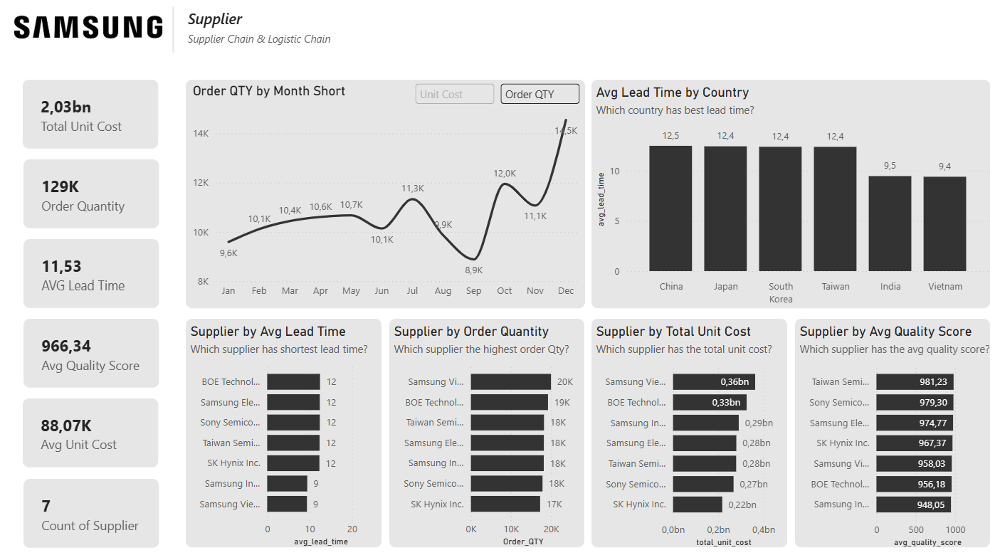
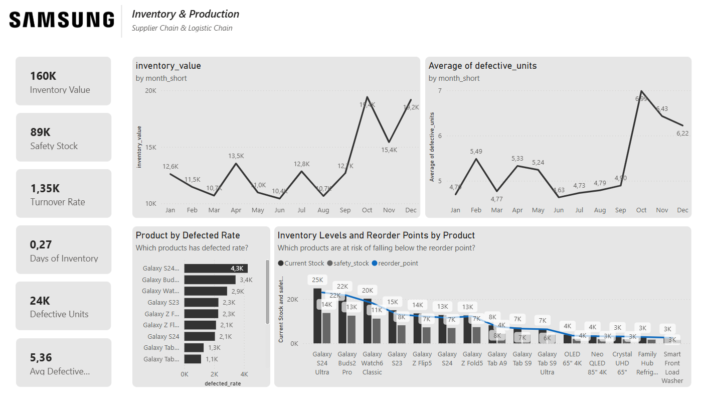
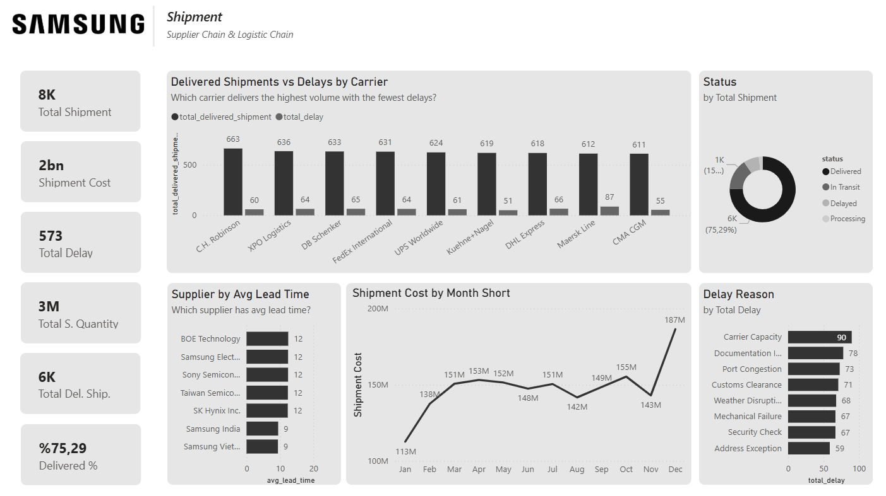
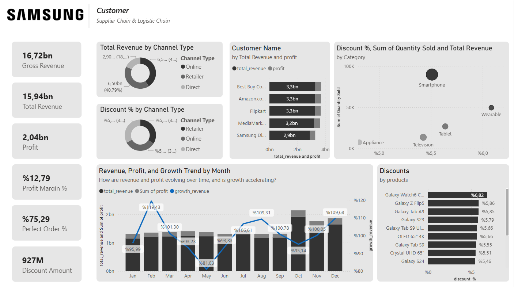
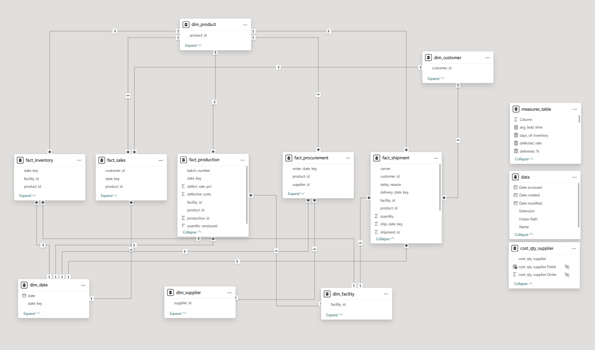

# Samsung Supply Chain & Logistics Dashboard 📊

## 📌 Project Overview
This project is a comprehensive Business Intelligence (BI) dashboard designed to analyze Samsung's supply chain and logistics operations end-to-end. The repository showcases the entire data analytics process, from raw data processing and relational data modeling (Star Schema) to the visualization of executive-level summaries and granular operational metrics.

## 🚀 Key Features & Metrics
The dashboard tracks critical business metrics across various stages of the supply chain:

* **Financial Performance:** Gross Revenue, Total Revenue ($15.94bn), Profit ($2.04bn), Profit Margin (12.79%), and Discount Amounts.
* **Operational Efficiency:** Perfect Order Rate (75.29%), Inventory Turnover Rate, and Defective Units tracking.
* **Supplier Analysis:** Average Lead Time, Quality Scores, and order volume evaluation by supplier and country.
* **Logistics & Shipment:** Delivery status tracking, shipment costs ($2bn), total delays, and root cause analysis for shipping delays.
* **Customer & Sales Channels:** Revenue distribution across different platforms (Best Buy, Amazon, Flipkart) and channel types (Retailer, Online, Direct).

## 📂 Dashboard Pages

### 1. Home
A user-friendly navigation hub that allows users to easily switch between the main analytical pages: Overview, Supplier, Inventory, Shipment, and Customer.

### 2. Overview
An executive summary providing a high-level view of the company's overall health. It aggregates revenue, profit margins, inventory values by product, and total shipment delays by carrier into a single, digestible screen.

### 3. Supplier
A deep dive into the supplier network. This page analyzes order quantities over time, average lead times by country, and supplier performance based on total unit cost and average quality scores.

### 4. Overview & Production (Inventory)
Focuses on stock health and manufacturing quality. 
* **Key Metrics:** Tracks Total Inventory Value (160K), Safety Stock levels, Turnover Rate, and Defective Units.
* **Visuals:** Includes a month-over-month analysis of defective units and inventory value. It also features a detailed bar/line combo chart comparing Current Stock, Safety Stock, and Reorder Points across various product lines (e.g., Galaxy S24 Ultra, Buds2 Pro).

### 5. Shipment
Analyzes logistics performance and transportation costs.
* **Key Metrics:** Total Shipments (8K), Shipment Cost ($2bn), Delivery Success Rate (75.29%), and Total Delays.
* **Visuals:** Highlights total delivered shipments vs. delays by carriers (C.H. Robinson, Maersk Line, etc.). It includes a breakdown of delivery statuses (Delivered, In Transit, Delayed) and identifies the top root causes for delays (e.g., Carrier Capacity, Document Issues, Port Congestion).

### 6. Customer
Provides insights into sales channels, profitability, and customer purchasing behavior.
* **Key Metrics:** Highlights total revenue generated by channel type (Retailer dominance at ~40%), alongside discount percentages.
* **Visuals:** Features a scatter plot correlating discount %, quantity sold, and total revenue by product category (Smartphones, Wearables, Tablets). It also tracks monthly revenue growth and pinpoints top-performing retail partners.

## 🗄️ Data Model
To ensure optimal performance and accurate DAX calculations, a **Star Schema** architecture was utilized. The complex supply chain processes were structurally divided into:

* **Fact Tables:** `fact_sales`, `fact_inventory`, `fact_production`, `fact_procurement`, `fact_shipment`
* **Dimension Tables:** `dim_product`, `dim_customer`, `dim_date`, `dim_supplier`, `dim_facility`
* **Measures:** A dedicated `measures_table` was created to neatly organize and manage all DAX formulas (Total Sales Cost, Turnover Rate, Profit Margin, etc.).

## 🛠️ Technologies Used
* **Data Visualization:** Power BI
* **Data Modeling:** Power Pivot / Power BI Data Model (Star Schema)
* **Calculations:** DAX (Data Analysis Expressions)
* **Data Cleaning & Transformation:** Power Query

## 💡 Key Insights Derived
1. **Logistics Bottlenecks:** "Carrier Capacity" and "Document Issues" are the leading causes of delays. Furthermore, specific carriers like Maersk Line show higher delay ratios, indicating a need for contract renegotiations or carrier diversification.
2. **Production Quality:** There is a noticeable spike in the average number of defective units around September and October, which requires an investigation into the manufacturing batches during that period.
3. **Channel Performance:** While Retailers bring in the largest chunk of revenue, Direct-to-Consumer (Samsung Direct) and Online channels present massive growth opportunities if optimized with the right discount strategies.
4. **Inventory Health:** Most flagship products (like the Galaxy S24 Ultra) are well above their safety stock levels, ensuring no stockouts, but careful monitoring is required to prevent overstocking and tying up capital.

---
*Disclaimer: This project is a portfolio piece. The data utilized is synthetic/mock data created for demonstration purposes.*
